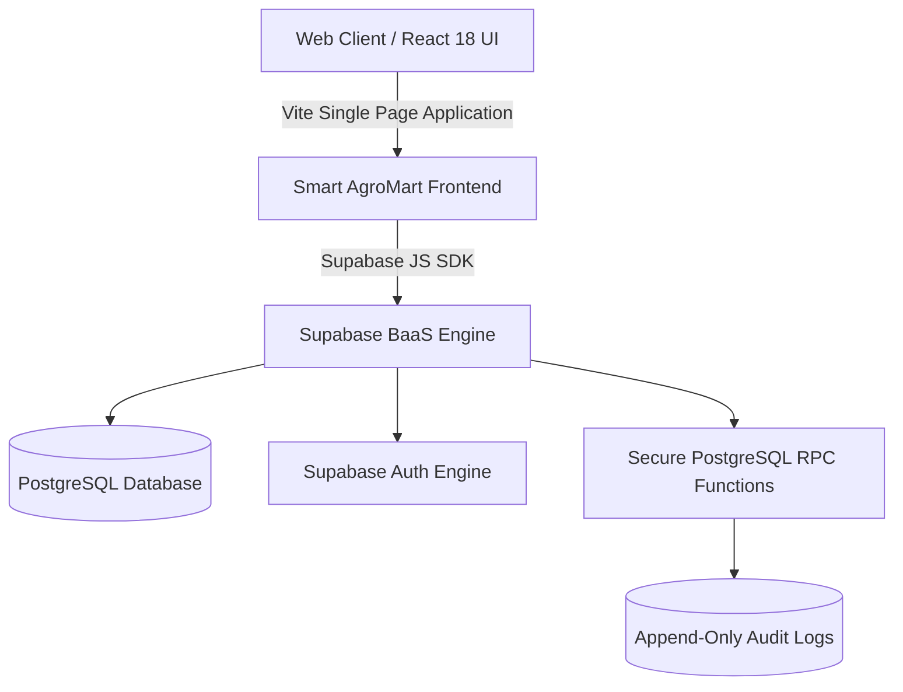

# Smart AgroMart — AI-Powered Agricultural ERP & Shop Management System


---

## 🌾 Project Overview

**Smart AgroMart** is a comprehensive, production-ready enterprise SaaS ERP engineered specifically for agricultural retail shops, seed & fertilizer dealers, and agri-input distributors across India. 

The system streamlines POS billing (Cash & Udhar Credit), FEFO batch inventory tracking, supplier procurement, farmer credit ledgers, automated business notifications, and rule-based predictive demand forecasting.

---

## ⚡ Problem Statement & Solution

### The Challenge
Agricultural input retailers in regional markets face distinct operational hurdles:
- **Strict Batch & Expiry Compliance**: Selling expired pesticides or fertilizers violates regulations and damages crop yields.
- **Complex Farmer Khata Credit**: Managing outstanding farmer credit without real-time ledger tracking leads to uncollected receivables.
- **Seasonal Sowing Demand Spikes**: Sowing peaks (Kharif/Rabi) cause stockouts if reorders are not calculated ahead of supplier lead times.

### The Solution
Smart AgroMart delivers a high-performance single-page web ERP powered entirely by **Supabase Backend-as-a-Service (BaaS)** with zero legacy backend proxies:
- **Instant POS Billing & FEFO Allocation**: Automatically consumes earliest-expiring valid product batches during billing.
- **Real-Time Farmer Khata**: Tracks credit limits, overdue invoices, and supports automated FIFO debt payment clearance.
- **Data Intelligence & Predictive Analytics**: Computes Average Daily Demand (ADD), safety stock bounds, reorder points, and credit risk scoring.

---

## 🛠️ Key Features & Core Modules

### 1. POS Billing & Invoice Engine
- Support for Full Cash, Partial Credit, Split Payment, and Full Udhar Credit billing.
- Dynamic GST calculation (0%, 5%, 12%, 18%, 28%) with customizable invoice prefixes (`AGM-2026-XXXXX`).
- FEFO batch selection with automatic stock deduction and `SALE` stock movement logging.

### 2. FEFO Inventory & Batch Tracking
- Real-time batch-level quantity tracking and expiry date monitoring.
- Prevents billing of expired stock and alerts when inventory dips below minimum threshold.

### 3. Farmer Khata & Credit Management
- Tracks farmer pending credit against configurable credit limits.
- Automated payment recording with FIFO invoice allocation and receipt generation.

### 4. Supplier Procurement & Payables
- Record purchases, update batch quantities, and manage supplier outstanding payables.

### 5. Rule-Based Predictive Analytics & Demand Forecasting
- **Statistical Demand Forecasting**: Calculates 7/14/30-day projected demand based on 30-day daily velocity.
- **Smart Reorder Formula**:
  $$\text{Safety Stock} = \lceil 1.5 \times \text{ADD} \times \sqrt{\text{Lead Time}} \rceil$$
  $$\text{Reorder Point} = (\text{ADD} \times \text{Lead Time}) + \text{Safety Stock}$$
  $$\text{Recommended Order} = \max(0, \text{FC}_{30\text{D}} + \text{Safety Stock} - \text{Current Stock})$$
- **Credit Risk Scoring**: Evaluates credit utilization, overdue days, and unpaid invoices into a $0-100$ risk score.
- **Business Health Score**: Transparent $0-100$ aggregate score derived from Sales, Inventory, Credit, and Expiry health.

### 6. Role-Based Access Control (RBAC) & Audit Logging
- Enforces role-based navigation and route guards for **Admin**, **Staff**, and **Accountant**.
- All critical actions (`LOGIN`, `BILL_CREATED`, `SETTINGS_CHANGED`, `ROLE_CHANGED`) are appended to `audit_logs`.

---

## 🏗️ System Architecture & Technology Stack



- **Frontend**: React 18, Vite 5, Tailwind CSS, Lucide Icons, Recharts.
- **Backend & Database**: Supabase PostgreSQL, Row Level Security (RLS), Stored Procedures (RPC).
- **Deployment**: Vercel Single-Page Application (SPA).

---

## 🔒 Security & Database Protection

- **Row Level Security (RLS)**: Direct client mutations on transactional tables (`bills`, `bill_items`, `payments`, `purchases`, `credit_transactions`, `stock_movements`, `audit_logs`) are blocked for anonymous users.
- **Transactional RPCs**: All business operations execute inside `SECURITY DEFINER` Postgres functions.
- **Zero Exposed Secrets**: Only public publishable Supabase keys are bundled into the client build. `.env` is gitignored.

---

## 🚀 Local Setup & Installation

### Prerequisites
- Node.js v18+ and npm installed.
- Active Supabase project.

### 1. Clone & Install Dependencies
```bash
git clone https://github.com/your-username/smart-agromart.git
cd smart-agromart
npm install
```

### 2. Configure Environment Variables
Copy `.env.example` to `.env` and provide your Supabase details:
```env
VITE_SUPABASE_URL=https://your-project.supabase.co
VITE_SUPABASE_ANON_KEY=your-publishable-anon-key-here
```

### 3. Run Development Server
```bash
npm run dev
```
Open `http://localhost:3000` in your browser.

### 4. Build for Production
```bash
npm run build
```

---

## 🌐 Deploying to Vercel

1. Push your repository to GitHub.
2. Import the project into Vercel.
3. Configure Build Settings:
   - **Framework Preset**: Vite
   - **Build Command**: `npm run build`
   - **Output Directory**: `dist`
4. Add Environment Variables in Vercel Dashboard:
   - `VITE_SUPABASE_URL`
   - `VITE_SUPABASE_ANON_KEY`
5. Deploy!

> **Note**: Add your deployed Vercel domain (e.g. `https://smart-agromart.vercel.app`) to your **Supabase Dashboard $\rightarrow$ Authentication $\rightarrow$ URL Configuration $\rightarrow$ Redirect URLs**.

---

## 📄 License & Author

Copyright © 2026 Smart AgroMart. All rights reserved.
Built for Smart Shop • Smarter Farming • Stronger Farmers.
